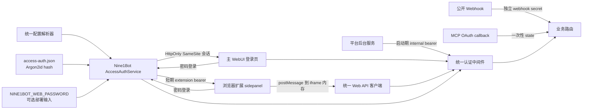

# Nine1Bot WebUI 访问密码完整修复方案

> 状态：已实施。代码、自动化测试、平台 Controller 真实交互和局域网纯 HTTP 浏览器验收已完成；Chrome 扩展可视化点击流程保留为发布前手工验收项。

## 实施结果（2026-07-21）

本方案已落到配置、凭据、服务端、WebUI、浏览器扩展、内部客户端、安装脚本和文档。下文的任务清单保留原始计划颗粒度；本节记录最终实现与验证事实。

已完成的关键结果：

- `setup`、`config` 和启动器统一通过 `ConfigContext` 解析有效配置与写入目标，项目配置向上查找边界已修正，JSONC 局部修改保留注释；
- 新密码只保存为独立 `access-auth.json` 中的 Argon2id 哈希，支持损坏凭据通过 `set-password` 修复；
- `auth.enabled: true` 且凭据缺失、弱密码或哈希损坏时，在监听端口前失败；
- 主 WebUI 使用站内登录页、HttpOnly/SameSite 会话 Cookie、统一 401 回收和 fetch-SSE；
- HTTP 登录完整可用，Cookie 不带 `Secure`；HTTPS 自动增加 `Secure`；非 loopback HTTP 页面持续显示未加密提示；
- 登录接口对声明长度和 chunked 实际字节数同时执行 1 KiB 上限，包含 peer 与全局失败退避和 Argon2 并发限制；
- 改密后运行中的服务会重载 credential version，立即撤销旧 Web/扩展会话；
- 扩展使用 `chrome.storage.session` 保存短期 bearer，经校验 source/origin 的 `postMessage` 交给 iframe，令牌不进入 URL 和同步存储；
- 平台后台服务使用启动期 internal bearer，并限制为 loopback 和 controller 所需路径；
- 旧 Basic 客户端保留兼容窗口，但服务不返回 `WWW-Authenticate`，不会触发浏览器原生密码框；
- 安装脚本停止创建会覆盖全局配置的安装目录默认配置，startup smoke 改用公开的 `/healthz`；
- 非 secure-context 下的复制入口增加 `execCommand` 和手动复制降级。

验证记录：

| 验证 | 结果 |
|---|---|
| `bun run ci:typecheck` | 通过 |
| `bun run ci:test` | 374 passed，0 failed |
| `bun run build:web` | 通过（仅保留原有 chunk size warning） |
| `packages/browser-extension` build | 通过 |
| OpenCode browser relay auth boundary | 2 passed，0 failed |
| 纯 HTTP 真实进程验收 | `/healthz` 200；登录 200；Cookie 含 HttpOnly/SameSite 且不含 Secure；认证后 `/config` 200；未认证 `/config` 401 且无 Basic challenge |
| 密码开启后的平台 Controller 真实交互 | 使用 Feishu 后台服务实际采用的 HTTP bridge；创建会话、读回会话、列出项目、Controller SSE 和中止会话全部成功；首个 SSE 为 `runtime.server.connected` 且 session id 匹配 |
| internal bearer 边界 | 未认证 `/project` 401；internal bearer 可访问平台 Controller 路径，但访问 `/config` 仍为 401 |
| 局域网纯 HTTP 浏览器验收 | 通过 `http://192.168.3.8:4198` 显示站内密码页和未加密提示；正确密码后进入完整 WebUI；`/access-auth/status` 返回 `authenticated: true`、`surface: web`、`secureTransport: false` |
| 独立 full 安全复核 | 通过；复核发现的 body 上限、全局限流、改密撤销、损坏凭据修复和畸形 Cookie 问题均已修复并补回归 |

发布前仍建议手工完成两项环境验收：

1. 在 Chrome 中加载构建后的扩展，实际点击验证登录、刷新、退出、token 过期和修改 relay origin 的视觉状态；
2. 在目标公网 HTTP/HTTPS 反向代理或隧道环境各跑一次浏览器验收，确认代理保留的 Host 与最终公开地址一致；本机局域网 IP + HTTP 已实测通过。

## 目标

把目前依赖 OpenCode 进程环境变量和浏览器原生 HTTP Basic 弹窗的访问密码，收敛成 Nine1Bot 自己维护的一套认证能力，并保证：

- 配置向导、`config` 命令、安装配置和实际启动读取同一份有效配置；
- `auth.enabled: true` 时一定存在可用凭据，否则服务在监听端口前明确失败；
- 主 WebUI 使用站内登录页和 HttpOnly 会话，不再依赖浏览器原生 Basic 弹窗；
- 局域网或公网通过纯 HTTP 地址访问时，仍可完成密码登录并使用完整 WebUI、API 和 SSE；
- 浏览器扩展使用短期、限定用途的令牌，不复用密码、不依赖第三方 Cookie；
- 平台后台服务使用启动期内部令牌，不再把用户密码拼进 Basic Header；
- Webhook、OAuth 回调、浏览器 relay 等特殊入口各自保持清晰、最小化的公开边界；
- 隧道不会在认证配置无效时继续把完整 WebUI 暴露到公网；
- 密码不再出现在命令行参数、成功日志或普通配置文件中。

## 已确认的访问约束

> [!IMPORTANT]
> 访问密码功能必须同时支持 HTTP 和 HTTPS。只要认证配置有效，用户通过局域网 IP、公网 IP、域名或反向代理提供的纯 HTTP 地址访问时，都能看到站内登录页、提交密码、建立会话并正常使用 WebUI。非 HTTPS 不能成为登录或业务请求的阻断条件，也不要求用户额外开启 `allowInsecureHttp` 一类开关。

纯 HTTP 下仍执行密码校验、登录限流、HttpOnly Cookie、SameSite、Origin 校验和会话撤销，但它只能提供应用层访问控制。由于链路没有 TLS，加密前提不存在，网络中的被动监听者可能读到登录请求和会话 Cookie，主动中间人还可能篡改页面或劫持会话。实现和文档必须如实提示这个边界，不能把“有访问密码”描述成“传输安全”。

## 需要确认的行为变化

以下四项是本方案的推荐决定，确认方案即表示接受这些有意的兼容性变化：

1. 新密码最少 12 个 Unicode 字符，最多 256 个字符；空白密码和全空白密码一律拒绝。已有不足 12 个字符的明文密码不会继续静默生效，启动时会给出重设命令。
2. 隧道开启但访问认证未真正激活时，启动前直接拒绝创建隧道，不再只打印警告后继续运行。
3. 主 WebUI 不再返回 `WWW-Authenticate`，因此不会再触发浏览器原生密码框；页面内登录是唯一默认交互。
4. 主动携带 `Authorization: Basic ...` 的旧 API 客户端保留一个发布周期的兼容窗口，默认用户名仍为 `nine1bot`；兼容层不服务浏览器弹窗，并输出一次弃用警告。

## 已确认的问题

| 优先级 | 问题 | 当前证据 | 直接影响 |
|---|---|---|---|
| P0 | 配置写入位置和运行时优先级不一致 | `setup.ts` 写全局配置；`install.sh` 创建安装目录配置；`loader.ts` 最终让安装/项目配置覆盖全局配置 | 向导提示保存成功，但安装目录里的 `auth.enabled: false` 可以继续覆盖新密码 |
| P0 | “已启用”不等于“已保护” | Schema 允许 `enabled: true` 且密码缺失、空字符串或极短；`server.ts` 只有密码为真值时才设置环境变量 | 配置看起来开启，实际服务可能完全无认证 |
| P0 | 隧道只检查布尔开关 | `orchestrator.ts` 只判断 `auth.enabled`，不判断认证服务是否可用 | 无密码状态可能被当成已保护并暴露公网 |
| P1 | 浏览器扩展健康检查存在假阳性 | sidepanel 只检查免认证的 `/browser/bootstrap`，随后直接挂载需要认证的根 WebUI | 扩展显示主进程可访问，但 iframe/API 实际返回 401 |
| P1 | 关闭认证后可能残留旧密码 | launcher 只在启用时设置 `OPENCODE_SERVER_PASSWORD`，禁用时没有清理继承或旧进程环境变量 | 配置已经关闭，页面仍可能要求密码；默认用户名还可能回落为 `opencode` |
| P1 | HTTP Basic 无站内登录态 | 当前全局中间件直接使用 Hono Basic Auth | 无可靠登出、会话撤销、错误提示和扩展登录流程 |
| P1 | 没有失败登录节流 | 认证中间件周围没有速率限制或退避 | 公网隧道可持续暴力尝试密码 |
| P2 | 密码会泄露到命令历史和终端输出 | `config set auth.password secret` 接收位置参数并回显整个值 | 密码进入 shell history、进程参数和日志截图 |
| P2 | 凭据文件权限没有形成明确契约 | 普通 `saveConfig()` 直接写入配置文件，未建立专用凭据存储和原子权限策略 | 明文密码和其他配置混放，权限依赖系统默认值 |

补充说明：已经确认受保护的根路径会返回 `401` 和 Basic challenge；Chrome 最终呈现哪一种原生弹窗样式尚未做真实浏览器视觉验证，但这不影响上述协议层结论。

## 不在本次范围内

- 不改 AI Provider 的 `/auth` 凭据存储；新接口使用 `/access-auth` 前缀，避免混淆。
- 不改变 Webhook 自身的签名、密钥、重放保护和路由语义。
- 不把 Nine1Bot WebUI 改造成多用户、角色权限或账号系统；本次仍是单实例、单访问密码。
- 不把浏览器 relay 开放到远程网络；`/browser/bootstrap` 和 `/browser/extension` 仍只允许可信 loopback 请求。
- 不自动信任任意 `Forwarded`/`X-Forwarded-*` 头；只识别 Nine1Bot 自己建立的隧道出口或明确可信的本地代理。
- 不尝试用自定义前端加密、摘要握手或混淆代替 TLS；这些机制无法保护随后在 HTTP 上传输的会话和页面内容。HTTPS 仍是推荐部署方式，但不是功能前置条件。

## 目标不变量

实现完成后，下列条件必须始终成立：

1. `auth.enabled === false`：不创建 Web 会话验证器，且显式清理两个旧 OpenCode Basic 环境变量。
2. `auth.enabled === true`：密码来源解析、强度校验和凭据加载全部成功后才能绑定监听端口。
3. `tunnel.enabled === true`：只有运行态认证状态为 `active` 才能创建隧道。
4. HTTP 和 HTTPS 使用同一套登录与授权语义；协议只影响 Cookie 的 `Secure` 属性和风险提示，不影响功能可用性。
5. 所有受保护 API 统一经过一处认证决策；新增路由默认受保护，公开路由必须显式登记并测试。
6. WebUI 的数据请求、SSE 和敏感状态只能在认证完成后初始化；任何 401 都能回到登录态并关闭旧流。
7. 扩展令牌只能由正确密码换取，保存在 `chrome.storage.session`，不能出现在 URL、同步存储或日志中。
8. 内部服务令牌每次启动随机生成，只允许 loopback 和明确的 controller 路径，不能当成普通 Web 会话使用。
9. 应用持久化文件只保存密码哈希；使用纯 HTTP 时，登录请求和后续会话仍会以未加密的网络传输经过链路，界面和文档必须明确提示这一风险。

## 总体架构



### 所有权边界

- `packages/nine1bot/src/access-auth/`：产品级密码、凭据、会话、令牌、限流和路由策略。
- `opencode/packages/opencode/src/server/`：只提供通用认证 provider 挂载点；Nine1Bot 未注册 provider 时保留上游 Basic 行为，避免破坏独立的 OpenCode `serve`。
- `web/src/`：站内登录门、认证状态和统一请求传输。
- `packages/browser-extension/`：扩展登录表单、session storage 和安全的 iframe token 交付。
- `packages/nine1bot/src/config/`：配置来源、写入目标和字段来源说明，不处理 HTTP 会话。

## 详细设计

### 1. 统一配置来源与写入目标

新增 `resolveConfigContext()`，一次返回：

```ts
type ConfigContext = {
  effective: Nine1BotConfig
  writePath: string
  sources: Array<{
    kind: 'global' | 'install' | 'project' | 'explicit'
    path: string
  }>
  provenance: Record<string, string>
}
```

有效配置的优先级从低到高固定为：

1. Schema 默认值；
2. `~/.config/nine1bot/config.jsonc`；
3. 发行版安装目录中的历史 `nine1bot.config.jsonc`；
4. 从当前项目目录向上找到的最近项目配置；
5. 显式 `--config <path>`。

写入目标只取当前最高优先级的可写配置；如果没有文件，则使用全局配置路径。`setup`、`config show/set/edit` 和 `launch` 全部使用同一个 `ConfigContext`，不再各自调用 `findConfigPath()` 猜测。

额外要求：

- 安装脚本不再主动创建安装目录默认配置，新安装由首次运行向导创建全局配置；已有安装配置继续读取，升级脚本不删除它。
- `config show` 同时展示合并后的配置、参与合并的文件和 `auth.enabled` 的最终来源，敏感值只显示“已配置/未配置”。
- 修改 JSONC 使用 `jsonc-parser` 的局部 edit，保留注释和无关格式；不再用 `JSON.parse()` 重写整个用户文件。
- `config set auth.password ...` 明确拒绝，并提示使用隐藏输入的密码命令。

### 2. 密码与凭据存储

新配置只保留行为开关，不保存新密码：

```jsonc
{
  "auth": {
    "enabled": true,
    "sessionTtlMinutes": 720,
    "legacyBasic": "compat"
  }
}
```

新增数据文件：

- Windows：`%LOCALAPPDATA%/nine1bot/access-auth.json`
- Linux/macOS：`$XDG_DATA_HOME/nine1bot/access-auth.json` 或 `~/.local/share/nine1bot/access-auth.json`

文件格式：

```json
{
  "schemaVersion": 1,
  "passwordHash": "$argon2id$...",
  "credentialVersion": 1,
  "updatedAt": "2026-07-20T00:00:00.000Z"
}
```

实现规则：

- 使用当前 Bun 已提供的 `Bun.password.hash()` / `Bun.password.verify()`，算法固定为 Argon2id，不增加密码库依赖。
- 密码长度为 12–256 个 Unicode 字符；不自动裁剪实际密码，防止设置值和登录值语义不同；空字符串和全空白字符串拒绝。
- 文件通过同目录临时文件、flush、原子 rename 写入；Unix 创建模式为 `0600`，目录为 `0700`；Windows 放在当前用户的 LocalAppData ACL 下。
- 凭据来源优先级：`NINE1BOT_WEB_PASSWORD` > `access-auth.json` > 历史 `auth.password`。
- 环境变量和历史明文只在运行时计算 verifier，不写回日志；历史明文存在时打印一次迁移提醒。
- `auth.enabled: true` 但来源缺失、哈希损坏或明文不满足新强度时，启动失败并给出具体修复命令。

CLI 新增以下安全操作：

```text
nine1bot config set-password      # 隐藏输入 + 二次确认，写 hash，并启用 auth
nine1bot config migrate-auth      # 把有效的历史 auth.password 转为 hash，局部删除明文字段
nine1bot config disable-auth      # 只关闭开关，保留 hash，便于再次启用
nine1bot config auth-status       # 显示 enabled/source/active，不显示密码或 hash
```

### 3. 运行态认证服务

`AccessAuthService` 在 server bind 前构造，输出不可含糊的运行态：

```ts
type AccessAuthRuntime =
  | { state: 'disabled' }
  | { state: 'active'; service: AccessAuthService }
```

不存在“enabled 但 verifier 为空”的第三种可运行状态。服务负责三类凭据：

| 类型 | 载体 | 生命周期 | 用途 |
|---|---|---|---|
| Web session | HttpOnly Cookie | 固定 12 小时，登出/改密/重启撤销 | 主 WebUI |
| Extension session | Bearer token | 最长 12 小时，改密/401/浏览器重启撤销 | sidepanel iframe API 与 SSE |
| Internal token | Bearer token | 仅当前 Nine1Bot 进程 | 平台后台 controller HTTP/SSE |

会话使用 32 字节 CSPRNG 生成的不透明 token，仅在内存中保存；最多保留 64 个 Web/扩展会话，超限淘汰最旧会话。服务重启后要求重新登录，这避免再持久化会话签名密钥，也提供天然的全量撤销边界。

#### HTTP 接口

| 方法与路径 | 公开性 | 行为 |
|---|---|---|
| `GET /access-auth/status` | 公开 | 返回 `enabled`、当前请求是否已认证、surface 和过期时间；`Cache-Control: no-store` |
| `POST /access-auth/login` | 公开、限流 | 校验密码；Web surface 设置 Cookie，extension surface 返回 bearer；不返回 hash |
| `POST /access-auth/logout` | 可匿名调用 | 撤销当前 token 并清 Cookie；重复调用仍返回 204 |
| `GET /healthz` | 公开 | 只返回进程健康和 `authEnabled`，不返回配置路径或其他内部信息 |

统一错误格式：

```json
{
  "error": {
    "code": "access_auth_required",
    "message": "Web access authentication is required"
  }
}
```

认证 API 不返回 `WWW-Authenticate`。缺失/错误密码统一为相同的 401 响应，限流为 429 并带 `Retry-After`。

#### Cookie 与请求来源

- Cookie 名称为 `nine1bot_access_session`，固定属性为 `HttpOnly; SameSite=Strict; Path=/`。
- HTTPS 请求增加 `Secure`；HTTP 请求不增加 `Secure`，从而保证局域网 IP、公网 IP 和纯 HTTP 反向代理下的登录态能够正常保存和发送。
- HTTP 与 HTTPS 都允许密码登录、刷新会话、API 请求、SSE 和退出登录；不能因为请求来自非 loopback HTTP 就返回拒绝登录错误。
- 有效协议从直连 URL 或 Nine1Bot 已知隧道/可信代理的转发信息推导。不能无条件相信客户端伪造的 `X-Forwarded-Proto`，否则会错误设置 Cookie 属性。
- Cookie 认证的非安全方法必须验证 `Origin` 与有效请求 origin 一致；Bearer 和内部 token 不使用 Cookie CSRF 规则。
- WebSocket 升级若未来使用 Cookie，必须同时校验 Origin。

| 有效访问协议 | 登录行为 | 会话 Cookie | 页面提示 |
|---|---|---|---|
| HTTP | 完整支持 | `HttpOnly; SameSite=Strict; Path=/`，不带 `Secure` | 非 loopback 地址持续显示“连接未加密”提示，但不阻断功能 |
| HTTPS | 完整支持 | 在相同属性上增加 `Secure` | 不显示未加密连接提示 |

#### 纯 HTTP 的安全边界

纯 HTTP 登录直接使用与 HTTPS 相同的 `POST /access-auth/login` JSON 请求，不额外设计前端摘要或自定义加密协议。原因是即使隐藏了登录请求中的原始密码，攻击者仍可在后续 HTTP 请求中窃取会话 Cookie、篡改前端脚本或替换响应内容，无法得到等价于 TLS 的安全性。

为了避免用户误判，服务和界面需要做到：

- 当有效协议是 HTTP 且访问地址不是 loopback 时，登录页和登录后的 Header 都显示可关闭但会在刷新后重新出现的“当前连接未加密”提示。
- 提示文案说明密码保护可以阻止不知道密码的人直接访问，但不能防止同一网络或公网链路上的监听与中间人攻击。
- 启动日志在服务绑定非 loopback 地址且启用密码时输出一次相同性质的警告，不输出密码、Cookie 或 token。
- 所有认证响应继续使用 `Cache-Control: no-store`，密码只放在 POST body，不进入 URL、Referer 或应用日志。
- 远程 HTTP 不属于浏览器 secure context。现有复制按钮不能只依赖 `navigator.clipboard`，需要统一降级到受控的文本选择/复制实现，并在失败时给出可手动复制的内容，保证“完整 WebUI”不止是认证和数据请求可用。

#### 登录限流

- 按直连 peer 地址建立失败桶，同时保留一个全局失败桶；默认不相信客户端自报 XFF。
- 同一 peer 在 5 次失败后进入 30 秒退避，连续失败指数增加，最大 15 分钟；成功登录清除该 peer 的失败状态。
- 在密码哈希校验前限制同一 peer 最多 1 个、全局最多 8 个并发校验，避免并发请求绕过“失败后计数”的窗口。
- 状态表最多 1000 项并按最近使用时间淘汰，防止伪造地址造成内存增长。
- 历史 Basic 失败和站内登录失败共用同一个 limiter。

### 4. 路由公开策略

新增路由默认受保护。公开项必须使用精确 method + path 规则：

| 路由 | 公开原因 | 保护条件 |
|---|---|---|
| `/`, `/index.html`, 实际静态 assets | 登录页面需要先加载 | 仅 GET/HEAD；解析后必须仍位于 `webDistDir` 内；不存在的 asset 不走远程 proxy，也不自动变成公开 API |
| `/access-auth/status`, `/access-auth/login`, `/access-auth/logout` | 登录协议 | login 限流、1 KiB body 上限、Origin 和 surface 校验；HTTP/HTTPS 均可使用 |
| `/healthz` | 启动与容器健康检查 | 只暴露最小状态 |
| `GET /mcp/oauth/callback` | 第三方 OAuth 跨站回跳不会携带 Strict Cookie | 必须继续校验一次性 state；其他 MCP auth 路由仍受保护 |
| `WebhookPublicRoutes()` | 外部平台回调 | 保持现有 webhook secret、签名和重放保护 |
| `GET /browser/bootstrap`, `WS /browser/extension` | 本地浏览器 relay 建链 | 必须是 loopback peer，且所有 Forwarded/XFF 地址也只能是 loopback |

特别禁止：不能因为 query 中存在 `client=browser-extension` 就绕过认证，也不能把整个 `/browser/*` 公开。

### 5. 主 WebUI 登录门

新增 `useAccessAuth.ts` 和 `AccessLogin.vue`，App 启动状态改为：

```text
loading auth status
  -> auth disabled/authenticated -> 初始化 API、SSE、session、provider、files
  -> auth required               -> 只挂载登录页
  -> login success               -> 执行一次完整业务 bootstrap
  -> any protected 401           -> 关闭 SSE、清敏感内存、回到登录页
```

必须完成的前端收敛：

- 所有 `fetch()` 进入统一 `request()`，统一处理认证 header、Cookie、401 和超时；文件预览、并行 session、provider/config 等现有直连请求一并迁移。
- 现有三类 SSE 订阅改为统一的 `fetch + ReadableStream` 传输，保留 heartbeat、断线重连、最大重试和连接 generation 语义；这样 Web Cookie 与扩展 bearer 使用同一实现。
- 登录前不创建 session、不加载 provider/config/files、不启动全局或 session SSE。
- Header/设置中增加“退出访问登录”；退出后立即关闭所有流和终端关联状态。
- 登录失败只显示通用提示；429 显示服务端提供的等待秒数；不得把服务端堆栈或凭据来源暴露给页面。
- 非 loopback HTTP 显示未加密连接提示，但登录按钮、业务 bootstrap、API 和 SSE 保持可用；HTTPS 或 loopback HTTP 不显示该提示。

### 6. 浏览器扩展认证

sidepanel 不再把 `/browser/bootstrap` 成功当作 WebUI 已认证。新的连接状态拆为：

```ts
type SidepanelConnectionState = {
  serverReachable: boolean
  accessAuthenticated: boolean
  relayConnected: boolean
}
```

流程：

1. 扩展调用 loopback `/browser/bootstrap` 确认实例和 relay 协议。
2. 调用 `/access-auth/status`；如果认证关闭，直接挂载 iframe。
3. 如果认证开启且无有效 extension token，sidepanel 自己显示密码输入框。
4. 密码只发送给 `POST /access-auth/login`，`surface: "browser-extension"`；成功后把 bearer 放入 `chrome.storage.session`。
5. sidepanel 使用精确 `targetOrigin` 的 `postMessage` 把 bearer 交给已加载 iframe；iframe 只保存在内存中，并让统一 API/SSE 客户端携带它。
6. origin 改变、token 到期或任一受保护请求返回 401 时，清除 session storage、卸载 iframe 并回到扩展登录页。

约束：

- token 不进入 query、fragment、iframe `src`、`chrome.storage.sync`、`chrome.storage.local` 或 console。
- 只有 loopback access-auth 接口对 `chrome-extension://` origin 开放必要的 CORS；其他 API 仍由同源 iframe访问。
- `/browser/extension` WebSocket 的 loopback 例外继续只服务 relay，不自动授予 WebUI/API 权限。
- 健康状态文案分别表达“主进程不可达”“需要访问密码”“relay 重连中”，消除现在的假阳性。

### 7. 内部平台服务与旧 Basic 兼容

launcher 每次启动生成 internal bearer，通过现有 `authHeader`/controller context 传给平台后台服务。中间件仅在 loopback 请求上接受它，并限制到当前平台 controller 实际使用的路径集合，例如：

- `/nine1bot/agent/*`
- 必要的 `/session/*`
- 必要的 `/project*`
- 对应的 controller SSE

路径集合由现有 Feishu HTTP bridge 测试固化；新增平台若需要扩展路径必须新增测试，不能把 internal token 变成全 API 通行证。

旧 Basic 兼容规则：

- 只接受客户端主动发送的 `Authorization: Basic`，用户名必须为 `nine1bot`。
- 用同一个 Argon2id verifier 校验密码，不再依赖 `OPENCODE_SERVER_PASSWORD`。
- 不返回 challenge，不让浏览器进入原生弹窗流程。
- `auth.legacyBasic: "disabled"` 可立即关闭；`"compat"` 在一个发布周期内可用，并只记录一次无敏感信息的弃用警告。
- Nine1Bot 启动前无条件 `delete process.env.OPENCODE_SERVER_PASSWORD` 和 `delete process.env.OPENCODE_SERVER_USERNAME`；独立 OpenCode `serve` 的旧行为由 generic provider fallback 保留。

### 8. 隧道与非本机暴露

隧道创建前使用 `AccessAuthRuntime.state` 进行 preflight：

- `active`：允许创建隧道；如果公开地址是 HTTPS，Cookie 带 `Secure`；如果公开地址是 HTTP，Cookie 不带 `Secure`，登录和 WebUI 仍可使用并显示未加密连接提示。
- `disabled`：拒绝创建隧道并退出非零，打印设置密码或关闭 tunnel 的命令。
- 认证配置损坏：更早在 server bind 前失败，不会出现“本地 server 已启动、隧道随后失败”的半运行状态。

直接绑定 `0.0.0.0`/`::` 且未启用认证时保留醒目警告，但不强制阻止，以免破坏明确的局域网/容器用法。启用认证后，局域网和公网的纯 HTTP 登录必须正常工作；同时继续建议公网部署优先使用 HTTPS，且不能把这条建议实现成强制跳转、登录拒绝或隐藏式 feature flag。

## 文件改动地图

| 文件 | 计划职责 |
|---|---|
| `packages/nine1bot/src/config/schema.ts` | 新 auth 行为字段、强约束和 deprecated 明文字段兼容 |
| `packages/nine1bot/src/config/loader.ts` | 统一 ConfigContext、来源/provenance、active write path |
| `packages/nine1bot/src/config/editor.ts` | 基于 `jsonc-parser` 做保留注释的局部写入 |
| `packages/nine1bot/package.json`, `bun.lock` | 声明 Nine1Bot 对 `jsonc-parser` 的直接依赖 |
| `packages/nine1bot/src/access-auth/credential-store.ts` | Argon2id hash 文件、原子写入、权限与迁移 |
| `packages/nine1bot/src/access-auth/service.ts` | Web/extension/internal session、限流、撤销和验证 |
| `packages/nine1bot/src/access-auth/http.ts` | `/access-auth`、Cookie、Origin、公开路由分类 |
| `packages/nine1bot/src/launcher/server.ts` | bind 前注入 AccessAuth provider，清理旧环境变量 |
| `packages/nine1bot/src/launcher/orchestrator.ts` | auth preflight、internal bearer、tunnel fail-closed |
| `packages/nine1bot/src/cli/cmd/setup.ts` | 写入真正生效的配置和 hash 凭据 |
| `packages/nine1bot/src/cli/cmd/config.ts` | 安全密码子命令、来源展示、禁止位置参数密码 |
| `opencode/packages/opencode/src/server/access-auth.ts` | 通用 provider 接口和上游 Basic fallback |
| `opencode/packages/opencode/src/server/server.ts` | 挂载 access-auth 路由/中间件，移除 Nine1Bot 专用 Basic 分支 |
| `web/src/composables/useAccessAuth.ts` | 前端认证状态机和 401 回收 |
| `web/src/components/AccessLogin.vue` | 主 WebUI 登录页 |
| `web/src/api/client.ts` | 统一认证 request 与 fetch-based SSE |
| `web/src/utils/clipboard.ts` 及现有复制按钮调用点 | 为非 secure-context HTTP 提供统一复制降级 |
| `web/src/App.vue` | 认证成功后再初始化业务资源 |
| `packages/browser-extension/src/sidepanel/*` | 扩展密码界面、三态健康检查、token 交付 |
| `packages/browser-extension/src/shared/server-config.ts` | access-auth URL 和 token 生命周期辅助函数 |
| `packages/browser-extension/src/background/*` | 必要时转发 session token 状态，不持久化密码 |
| `install.sh` | 停止制造高优先级默认安装配置，修正文案 |
| `scripts/test-startup.sh` | 使用 `/healthz`，补充 auth/tunnel 启动探针 |
| `README.md`, `README.zh.md`, config examples | 新登录流程、CLI、安全迁移和隧道要求 |

## 实施任务

所有任务都先补失败测试再实现。任务可分提交，但在 Task 1–6 全部完成前不发布中间版本，避免配置模型、Basic 中间件和新登录页处于混合状态。

### Task 1：锁定当前回归并统一配置上下文

**测试先行：**

- [ ] 全局 `auth.enabled: true` + 安装配置 `auth.enabled: false` 时，测试明确展示最终来源和 write path。
- [ ] `setup` 写入后重新解析，断言有效配置立即变为 enabled。
- [ ] 显式配置、最近项目配置、历史安装配置、全局配置的优先级矩阵。
- [ ] `config show` 在只有全局配置时仍能显示；`config edit/set` 与 launch 使用同一 write path。
- [ ] JSONC 局部修改保留注释和无关字段。

**实现：**

- [ ] 增加 `ConfigContext` 和 provenance。
- [ ] 迁移 setup/config/launch 调用点。
- [ ] 安装脚本停止创建新安装配置，但保留历史文件兼容。

### Task 2：建立凭据存储和 fail-closed 运行态

**测试先行：**

- [ ] `{ enabled: true }`、空密码、全空白、1–11 字符均阻止启动。
- [ ] 12 和 256 字符密码可用，257 字符拒绝。
- [ ] Argon2id hash round-trip、损坏 hash、原子替换和 Unix 权限测试。
- [ ] 环境变量、hash store、历史明文的优先级测试。
- [ ] 改密递增 credential version，并立即撤销已有 Web/extension session。
- [ ] disable 后旧 OpenCode 用户名/密码环境变量均被删除。

**实现：**

- [ ] 完成 credential store 和迁移命令。
- [ ] 构造唯一的 `AccessAuthRuntime`，并在 bind 前验证。
- [ ] `set-password` 使用隐藏输入和确认，不输出密码/hash。

### Task 3：替换服务端 Basic 总闸

**测试先行：**

- [ ] disabled、有效 Cookie、过期 Cookie、extension bearer、internal bearer、legacy Basic 的认证矩阵。
- [ ] 未认证 API 返回 JSON 401 且没有 `WWW-Authenticate`。
- [ ] 静态登录页、healthz、OAuth callback、webhook 和 loopback relay 的精确公开规则。
- [ ] 非 loopback、伪造 Forwarded/XFF、非白名单 browser path 全部不能利用 relay 例外。
- [ ] 登录限流、`Retry-After`、成功重置、表容量上限。
- [ ] HTTP/HTTPS 登录都成功；HTTP Cookie 不带 `Secure`，HTTPS Cookie 必须带 `Secure`。
- [ ] 局域网 IP、公网 IP 和纯 HTTP 反向代理下，登录、刷新、受保护 API、SSE 和退出登录全部可用。
- [ ] Cookie 的 CSRF Origin 校验在 HTTP 和 HTTPS 下都生效，且伪造 `X-Forwarded-Proto` 不能改变 Cookie 安全属性。

**实现：**

- [ ] 完成 generic provider 挂载点和 Nine1Bot provider。
- [ ] 完成 `/access-auth` 接口、会话、限流和公开路由分类。
- [ ] 保留独立 OpenCode serve 的兼容行为。

### Task 4：接入主 WebUI

**测试先行：**

- [ ] 未认证时只渲染登录页，业务 bootstrap 请求数为 0。
- [ ] 登录成功只初始化一次业务资源和 SSE。
- [ ] 错误密码和 429 显示正确用户提示；非 loopback HTTP 显示未加密连接警告但不会阻断登录。
- [ ] 任意受保护请求 401 后关闭所有流并返回登录页。
- [ ] fetch-based SSE 覆盖首次连接、heartbeat、分片行、重连、关闭和 401。
- [ ] logout 后 Cookie 清除、页面敏感状态清空且不能自动重连 SSE。
- [ ] 在非 loopback HTTP 环境禁用 `navigator.clipboard` 后，文件内容、预览路径、Webhook URL 等现有复制入口仍能降级工作。

**实现：**

- [ ] 新增登录组件和 auth composable。
- [ ] 把所有 raw fetch 收口到统一 request。
- [ ] 把 EventSource 收口到支持 Cookie/Bearer 的 fetch stream。

### Task 5：修复浏览器扩展认证链

**测试先行：**

- [ ] bootstrap 200 + access status 返回 `enabled: true, authenticated: false` 时显示“需要访问密码”，不得显示已连接。
- [ ] extension token 只写 `chrome.storage.session`。
- [ ] postMessage 必须校验 parent/source/origin，token 不进入 frame URL。
- [ ] origin 改变、token 过期和 API 401 都清 token 并卸载 iframe。
- [ ] auth disabled 时保持现有无密码体验。
- [ ] relay 断开只影响 relay 状态，不误判 WebUI access session。

**实现：**

- [ ] 增加 sidepanel 密码界面和三态状态机。
- [ ] 安全交付 bearer 到 iframe 内存。
- [ ] 用统一 request/SSE 携带 extension bearer。

### Task 6：迁移内部客户端、隧道和安装流程

**测试先行：**

- [x] 平台 controller 的 JSON 与 SSE 均使用 internal bearer，不含用户密码。
- [x] internal bearer 仅 loopback 且只允许实际 controller 路径。
- [ ] tunnel + disabled/missing/invalid auth 均在创建隧道前失败。
- [ ] tunnel + active auth 正常启动；HTTPS 公网地址得到 Secure Cookie，HTTP 公网地址得到可用的非 Secure Cookie。
- [ ] 安装后首次 setup 不再被安装目录默认配置覆盖。
- [ ] 启动 smoke test 使用 `/healthz`，不能用受保护 API 的偶然 200 代替健康判断。

**实现：**

- [x] 替换 `createAuthHeader()` 为 internal bearer。
- [ ] 完成 tunnel preflight 和可信 public origin 处理。
- [ ] 更新 installer、startup smoke 和帮助文案。

### Task 7：兼容迁移、文档与全量验证

- [ ] 文档说明明文迁移、弱密码启动失败、Basic 兼容窗口、HTTP 传输风险和回滚方式。
- [ ] 配置 example 不再出现真实 `auth.password`，改为 set-password 命令和可选环境变量示例。
- [ ] 记录 Basic 兼容层的删除版本/issue；默认新 UI 不使用它。
- [ ] 执行完整自动化和手工矩阵。
- [ ] 对修改做一次独立安全 review，重点检查公开路由扩大、token 泄漏、401 重连循环和反向代理信任。

## 自动化验证命令

实现时至少执行：

```powershell
bun test packages/nine1bot/src/config packages/nine1bot/src/access-auth
bun test opencode/packages/opencode/test/server/browser-auth.test.ts opencode/packages/opencode/test/server/access-auth.test.ts
bun test web/test/access-auth.test.ts web/test/api-auth-stream.test.ts
bun test packages/browser-extension/test
bun run ci:typecheck
bun run build:web
bun run ci:test
```

如果完整 `ci:test` 受 provider 或机器环境污染，应把认证相关测试单独进程重跑，并同时记录基线失败；不能通过吞掉异常让测试变绿。

## 手工验收矩阵

| 场景 | 预期结果 |
|---|---|
| auth disabled，本机访问 | 根页面直接进入，不出现登录页，不存在旧 Basic 弹窗 |
| auth enabled，首次访问 | 静态页面 200，业务 API 尚未发起，只显示站内登录页 |
| 错误密码连续尝试 | 通用错误；超过阈值返回 429 和倒计时；日志无密码 |
| 正确密码登录并刷新 | 页面正常；Cookie 为 HttpOnly/SameSite；刷新仍已登录 |
| 局域网 IP + HTTP | 密码登录、刷新、API、SSE 和退出全部可用；Cookie 不带 Secure；页面持续提示连接未加密 |
| 公网 IP/域名 + HTTP | 与局域网 HTTP 功能一致；不强制跳转 HTTPS；明确提示链路监听和会话劫持风险 |
| 非 secure-context HTTP 的复制操作 | 所有现有复制按钮使用 fallback 成功，或展示可手动复制内容，不因 `navigator.clipboard` 缺失静默失败 |
| HTTPS | 完整功能可用；Cookie 带 Secure；不显示未加密连接提示 |
| 主动退出 | 会话立即失效，SSE 关闭，再访问受保护 API 为 401 |
| 服务重启 | 旧 Web/extension session 失效，需要重新登录 |
| 修改访问密码 | 所有旧会话撤销，新密码可登录，旧密码不可用 |
| inherited OpenCode env + auth disabled | Nine1Bot 页面不再被旧 env 保护 |
| 浏览器扩展、auth enabled | 先显示扩展密码页；成功后 iframe、API、SSE 正常 |
| 浏览器扩展、错误 origin | token 清除，不把凭据发往旧 origin |
| relay 断开 | WebUI 登录态保留，单独显示 relay 重连状态 |
| tunnel + auth disabled/invalid | 隧道不创建，进程给出可执行修复提示 |
| tunnel + auth active，公开地址为 HTTPS | 登录成功、Cookie 带 Secure、受保护 API 不可匿名访问 |
| tunnel + auth active，公开地址为 HTTP | 登录和完整 WebUI 可用、Cookie 不带 Secure、页面显示未加密连接提示 |
| legacy Basic 主动请求 | `compat` 模式可用且仅警告一次；`disabled` 模式返回 401 |
| public webhook | 不要求 Web session，但错误/缺失 webhook secret 仍失败 |
| MCP OAuth browser callback | 正确 state 可完成；缺失/错误 state 失败；不因 Strict Cookie 卡住 |
| SSE 网络中断后恢复 | 不重复业务初始化，generation 增加，并通过现有 session/runtime reconciliation 收敛到服务端最终状态 |

## 发布与迁移

### 现有用户

1. 升级后先解析并打印有效配置来源，不自动改写用户文件。
2. 若发现有效且长度合规的历史 `auth.password`，允许启动并提示执行 `nine1bot config migrate-auth`。
3. 若历史密码不足 12 字符，阻止认证模式启动并提示 `nine1bot config set-password`；不会退化为无认证。
4. 显式迁移成功后才从 JSONC 删除明文字段，并立即验证 hash 可登录。
5. Basic compatibility 保留一个发布周期，日志只输出一次弃用提示。

### 新用户

- 安装脚本不生成安装目录配置。
- setup 把普通设置写到统一 write path，把密码 hash 写到 access-auth store。
- 默认使用站内 Web session；不引导用户使用 `config set auth.password`。

### 回滚

- 新旧配置文件路径保持可识别，不自动删除历史安装配置。
- 回滚到不认识 hash store 的旧版本时，需要通过 `NINE1BOT_WEB_PASSWORD` 或旧版本的安全手动配置重新提供密码；不会为了回滚保留新的明文副本。
- 若新认证 provider 出现严重问题，代码回滚点是 generic provider 注册和 Web auth gate 两处；public webhook 数据与 Provider 凭据文件不受影响。

## 完成标准

- [ ] setup/config/launch 对同一环境给出相同的 active config 和 auth 状态。
- [ ] 不存在 enabled 但未保护的可运行状态。
- [ ] 主 WebUI 全流程没有浏览器原生 Basic 弹窗。
- [ ] 局域网和公网的纯 HTTP 地址均能完成密码登录、刷新、API、SSE 和退出登录，不依赖额外开关或 HTTPS 跳转。
- [ ] HTTP Cookie 不带 `Secure`，HTTPS Cookie 必须带 `Secure`；两种协议下的 Origin 校验和会话撤销行为一致。
- [ ] 非 loopback HTTP 的页面与启动日志都明确提示未加密风险，但警告不阻断功能。
- [ ] 依赖 secure-context 浏览器 API 的现有功能具有 HTTP fallback；至少所有复制入口通过手工和自动化验证。
- [ ] Web Cookie、extension bearer、internal bearer 三条链路各自通过自动化和手工测试。
- [ ] 密码不出现在进程参数、配置明文、URL、日志或浏览器持久同步存储。
- [ ] 登录失败限流有效，401 不会触发 SSE 无限重连。
- [ ] 隧道在认证无效时 fail closed。
- [ ] Webhook、OAuth callback 和 browser relay 的既有边界未被扩大。
- [ ] `bun run ci:typecheck`、`bun run build:web` 和认证相关测试全部通过。
- [ ] README、中文 README、配置示例和安装提示与实际行为一致。
