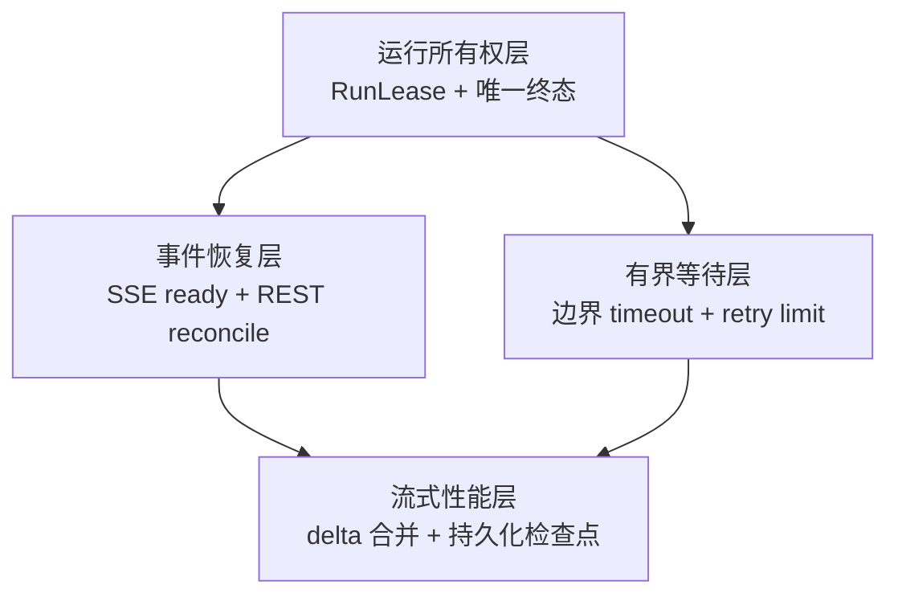
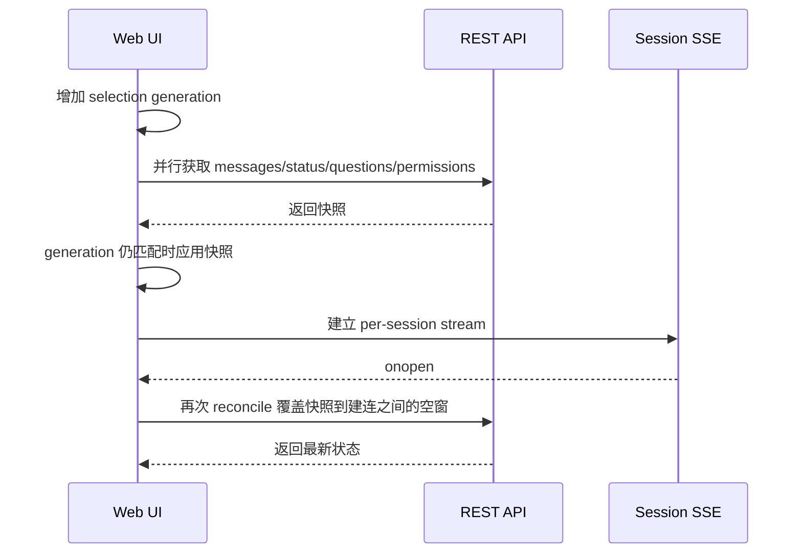

# Agent Runtime 分层稳定化设计

日期：2026-07-18

状态：待用户审阅

适用范围：Nine1Bot 单进程部署下的 Agent 核心状态机、Runtime Event/SSE、超时与错误、流式性能和 Web 会话状态

## 1. 目标与边界

本次改造要解决远程 Web 使用中出现的任务状态错乱、消息发送后长时间无反馈、界面假运行、工具调用期间状态闪烁和长回复逐渐卡顿。实现保持现有 Controller HTTP API、最终消息存储格式和单进程部署方式，不引入新的外部服务。

完成后应满足以下结果：

1. 同一个 session 在任意时刻最多只有一个 Agent loop，旧任务不能释放或覆盖新任务的运行状态。
2. `runtime.turn.completed` 只表示整个 turn 已结束，模型 step 和工具调用之间不会产生假终态。
3. Web 在发送消息前确认会话事件流已经建立；首次加载和 SSE 重连后会通过 REST 恢复消息、运行状态和待处理交互。
4. 默认不限制整个 Agent turn 的总时长；无响应的 provider 连接、MCP 和 Web 控制请求使用各自的边界超时，provider 重试次数和单次等待时间都有上限。
5. 流式 delta 不再每个 token 都重写并传输持续增长的完整 part；正常结束时仍然完整持久化最终消息。
6. 快速切换 session 时，旧请求和旧事件不能覆盖当前 session。

本轮明确不包含：

- 多进程、多副本或分布式共享状态；
- WebSocket、Redis、外部事件总线或持久化事件日志；
- 与本次稳定性问题无关的 Agent、平台适配和 UI 重构；
- 提交本地调查记录 `docs/2026-07-18-agent-runtime-remote-web-stall-investigation.md`。

## 2. 总体设计

改造分成四个相互独立的稳定化层。每层有自己的测试和提交，后一层只依赖前一层提供的稳定语义。



### 2.1 运行所有权层

`SessionPrompt` 为每次成功 reserve 的运行创建唯一 `RunLease`。lease 包含不可复用的 ID、AbortController 和只允许自身释放的 release 操作。

取消任务时只触发当前 lease 的 abort，不立即删除 busy reservation。旧 loop 真正退出后，必须携带自己的 lease ID 才能执行 compare-and-release。这样会带来一个有意保留的行为：用户点击停止后，新的发送请求可能短暂收到 409，直到旧 provider 或工具响应 abort 并完成清理。系统优先保证不会让两个 loop 同时写入一个 session。

`SessionProcessor` 只报告当前模型 step 的结果，例如 `continue`、`stop`、`compact` 或 `error`。整个 turn 的 `runtime.turn.completed`、`runtime.turn.failed`、`runtime.turn.cancelled` 和 `session.idle` 由外层 Agent loop 统一发布，每轮只允许出现 completed、failed、cancelled 三者之一。用户主动停止时发布 cancelled，Web 将它展示为“已停止”，不展示为运行错误。

后台 `promptAsync()` 捕获异常后必须发布失败事件，并保留可诊断的错误信息，不能只写日志后释放为普通 idle。

### 2.2 事件恢复层

per-session Runtime Event SSE 是当前 session 消息 part、interaction 和生命周期的权威实时来源。目录级 raw `/event` 继续负责其他 session 的完成通知和专用消费者，但 Web 不再把当前 session 的同一事件从两条流重复送入 `handleSSEEvent()`。现有 SSE endpoint 默认行为保持兼容；Web 使用 `content=false` 查询参数订阅 raw/global stream，使服务端不向这些辅助连接写入 message part 和 delta，当前会话内容只走 per-session stream。

EventSource subscription 对调用方提供以下能力：

- `ready` Promise：第一次 `onopen` 后 resolve，建连失败或超过 5 秒则 reject；
- `onReconnect` 回调：断线后的下一次 `onopen` 触发；
- `close()`：关闭连接并拒绝尚未完成的 ready；
- 明确的连接 generation，旧连接回调不能影响新 session。

Web 选择 session 时采用以下顺序：



发送消息前，Web 必须确保目标 session 的事件流已 ready。首次建连和每次重连后都执行 `reconcileSession(sessionID, generation)`：重新获取消息、session status、Question 和 Permission，并仅在 generation 与当前 session 一致时应用结果。

reconcile 开始后，当前 connection generation 收到的新事件先进入内存缓冲区。REST 快照应用完成后，Web 按接收顺序重放缓冲事件，再切回实时应用。这样快照请求期间到达的 delta、终态或 interaction 不会被较旧快照覆盖；旧 connection generation 的缓冲区会直接丢弃。

服务端本轮不实现 SSE replay。可靠性来自“实时事件负责低延迟，REST 快照负责恢复”，避免引入持久化事件日志。

### 2.3 有界等待层

Controller 编译出的 `runtime.timeoutMs` 要继续传入 `SessionPrompt.PromptInput`，但它是调用方主动选择的整轮上限，不是系统默认限制。Web 交互式对话不设置该字段时，Agent turn 可以持续运行到自然完成、用户取消或不可恢复错误。Schedule、Webhook 等无人值守入口可以显式设置 `runtime.timeoutMs`；只有这时 Agent loop 才创建整轮 deadline，并把 deadline 派生的 AbortSignal 传给资源解析、LLM、工具和 interaction。

没有整轮 deadline 不等于允许外部依赖无限挂起。系统只约束可以明确判断为连接或重试异常的局部边界；正常持续产生进展的长任务不因累计运行时间被终止。

各边界采用以下默认值：

| 边界 | 默认限制 | 结束行为 |
|---|---:|---|
| 整个 Agent turn | 默认不限制；仅在调用方显式传入 `runtime.timeoutMs` 时限制 | 显式 deadline 到期后 abort 当前 lease，发布 `runtime.turn.failed` 和用户可见 timeout error |
| EventSource 首次 ready | 5 秒 | 本次发送失败，Web 清除 running 并提示事件通道连接失败 |
| Web 消息、模型切换和 abort 请求 | 30 秒 | fetch 终止并显示请求超时；abort 失败时不伪造 idle |
| MCP `listTools()` | 每个 server 10 秒 | 标记该 MCP 本轮不可用，发布 resource failure，其他资源继续解析 |
| provider 首个事件或流中断档 | 连续 5 分钟没有任何流事件；每次收到事件后重新计时 | abort 本次 provider 调用并进入有限重试；持续输出的长响应不会触发 |
| provider 调用 | 最多 5 次总尝试，包括第一次请求；单次 retry sleep 最多 30 秒 | 第 5 次仍失败时结束 turn；最多发生 4 次 retry sleep |
| Question | 默认不限制等待时长 | SSE 重连后恢复 pending Question；用户取消或显式 turn deadline 到期时清理 pending request 并 reject Promise |

显式 `runtime.timeoutMs` 可以根据入口和任务类型设置，所有局部等待都不能越过显式 deadline。Permission 维持现有 5 分钟语义，但也要响应用户取消和显式 deadline abort。

MCP 工具枚举复用现有 server timeout 和 tools cache。连接或配置版本未变化时优先使用缓存；需要刷新时各 server 可以并行执行，但单个 server 的失败不能阻塞其他 server。

### 2.4 流式性能层

流式处理分成“实时 delta”和“完整检查点”两条内部路径：

- Processor 将同一 part 的 delta 在 50 毫秒窗口内合并，发布体积固定的 delta 事件。delta 只携带 `sessionID`、`messageID`、`partID`、字段类型和新增文本，不携带累计完整文本。
- Session 每 500 毫秒最多写入一次完整 part 检查点。part 开始、正常结束、错误、abort 和 turn 结束前都必须强制 flush。
- Runtime per-session SSE 将紧凑 delta 投影给新 Web 客户端；完整 part 检查点继续使用现有 updated 事件，以保留历史消费者的兼容性和断线恢复能力。Web 对紧凑 delta 执行追加，对完整 checkpoint 执行幂等替换，不能把 checkpoint 文本再次追加。
- Web 在一个 animation frame 内合并同一 part 的 delta，再更新 Vue 状态。Markdown 解析按输入文本缓存，自动滚动每帧最多执行一次。

正常结束后，最终完整 part 与当前存储格式完全一致。进程异常退出时最多丢失最近 500 毫秒尚未 checkpoint 的流式文本；重新进入 session 后以最后一个完整检查点为准。这一取舍用于避免每个 token 都重写完整 JSON。

## 3. 组件与接口调整

| 组件 | 主要职责 | 设计调整 |
|---|---|---|
| `session/prompt.ts` | reserve、cancel、Agent loop、终态 | 引入带 ID 的 `RunLease`，compare-and-release，只在显式配置时创建 turn deadline，并统一最终事件 |
| `session/processor.ts` | 单个模型 step 和流式 part | 移除 turn completed 发布；返回 step outcome；合并 delta 并触发检查点 |
| `session/llm.ts` | provider 流式调用 | 增加连续无事件 watchdog；收到任意流事件时重置，正常持续输出不累计计时 |
| `session/index.ts` | part 存储和 Bus 事件 | 区分紧凑 delta 与完整 checkpoint，提供显式 flush |
| `runtime/controller/events.ts` | Bus 到 Runtime Event 投影 | 增加紧凑 part delta envelope；completed 仅接受外层 loop 终态 |
| `runtime/bridge/prompt-compiler.ts` | Turn snapshot 到 PromptInput | 继续传递 `timeoutMs` |
| `mcp/index.ts` | MCP 工具枚举 | 使用有界并行刷新和现有 cache，单 server 失败可降级 |
| `question/index.ts` | 用户问题等待 | 接收 AbortSignal 和可选 deadline，用户取消或显式 deadline 到期后清理 pending Promise |
| `web/src/api/client.ts` | REST 和 EventSource | 所有控制请求使用 timeout；session subscription 暴露 ready/reconnect |
| `web/src/composables/useSession.ts` | 会话选择、发送和事件应用 | 使用 selection generation、reconcile 和单一当前会话事件源 |
| Web 消息组件 | delta 展示、Markdown、滚动 | 按帧合并更新，缓存 Markdown，限制滚动频率 |

新接口仅在仓库内部使用。Controller HTTP 请求和响应字段保持兼容；Runtime Event 增加一种 delta envelope，现有完整 part updated envelope 保留。

## 4. 状态与错误语义

一次 turn 的合法状态变化为：

```text
idle -> busy -> completed -> idle
idle -> busy -> failed -> idle
idle -> busy -> aborting -> cancelled -> idle
```

模型 step、tool started/completed、retry 和 interaction 都属于 busy 内部状态，不得转换成 session idle。

错误分成三类：

1. **可恢复连接错误**：SSE 断线时保留当前 UI，重连后 reconcile。只有 ready 超时或 REST 恢复失败才显示连接错误。
2. **资源降级错误**：单个 MCP 枚举超时会发布 `runtime.resource.failed`，但不会阻止其他资源和模型继续运行。
3. **turn 终止错误**：显式整轮 timeout、provider 重试耗尽和后台未处理异常会发布 `runtime.turn.failed`，然后由 lease owner 释放为 idle。Question 默认可以持续等待；用户取消时进入 cancelled，显式 deadline 到期时才进入 failed。

Web 的 abort 请求只有在 HTTP 成功且后端状态最终变为 cancelled、idle 或 failed 后才清除 running。请求返回 5xx 或 timeout 时，Web 保持后端状态未知，并立即执行一次 reconcile，不能直接伪造停止成功。

## 5. 测试设计

每项实现都必须先增加能在旧代码上失败的回归测试，再完成最小修复。

### 5.1 核心状态机

- A 被 cancel 后，在 A 未退出前 B 仍然收到 409；A 退出后 B 可以 reserve。
- A 的 lease release 不能删除 B 的 lease。
- `finishReason=tool-calls` 不发布 turn completed 或 session idle。
- 一个多 step turn 只发布一次 completed。
- `promptAsync()` 后台异常发布 failed，并最终回到 idle。

### 5.2 Web 与 SSE

- `sendMessage()` 在 EventSource ready 前不发 POST。
- ready 超时会清除 running 并显示可恢复错误。
- SSE 重连后会重新获取 messages/status/questions/permissions。
- A 到 B 快速切换时，A 的迟到响应不能覆盖 B。
- raw `/event` 和 per-session stream 同时收到事件时，当前 session 只应用一次。
- abort HTTP 失败不会直接把 running 设为 false。

### 5.3 超时与资源

- Prompt compiler 保留 `timeoutMs`。
- 未设置 `timeoutMs` 时不会创建整轮 timer，长时间但持续有进展的 turn 不会因累计时长退出。
- 显式 deadline abort 会结束 Agent loop 并发布一次 failed。
- provider 连续 5 分钟没有流事件时触发本次调用 timeout，收到任意事件都会重置计时。
- provider 在第 5 次总尝试失败后停止，单次 retry sleep 不超过 30 秒，也不能越过显式 deadline。
- MCP A 超时不阻塞 MCP B 的工具返回，并产生 resource failure。
- Question 没有默认计时器；用户取消或显式 deadline abort 会移除 pending request 并 reject Promise。
- Web POST 超时会终止 fetch 并显示明确错误。

### 5.4 流式性能

- 高频 delta 在 50 毫秒窗口内合并为一次紧凑事件。
- 紧凑事件不包含累计完整文本。
- 500 毫秒内完整 part 最多持久化一次，part 结束时强制 flush。
- 正常完成后的存储文本与全部 delta 拼接结果一致。
- Web 同一 animation frame 内只更新一次 part、解析一次 Markdown，并触发一次滚动。

## 6. 验证范围

每个提交运行该批相关测试。全部批次完成后至少运行：

```powershell
cd opencode/packages/opencode
bun test test/server/session-prompt-busy.test.ts test/controller/controller-events.test.ts test/session/retry.test.ts test/question/question.test.ts test/mcp
bun run typecheck

cd ../../..
bun test web/test
web/node_modules/.bin/vue-tsc.exe --noEmit -p web/tsconfig.json
bun run build:web

cd packages/nine1bot
bun run typecheck
```

还要进行一次远程等价的人工验证：发送长回复、执行至少一次工具调用、停止后立即尝试重发、主动让浏览器离线 3 至 5 秒后恢复，并确认消息、running、Question 和 Permission 都能自动恢复一致。

## 7. 提交边界

实现按以下顺序提交，每个提交都必须能独立通过相关测试：

1. `docs: design layered agent runtime stabilization`
   - 只提交本设计文档，不提交调查记录或其他现有未跟踪文档。
2. `fix: stabilize agent turn ownership and completion`
   - RunLease、abort 语义、唯一终态、后台错误事件及核心回归测试。
3. `fix: recover web sessions across event gaps`
   - SSE ready/reconnect、REST reconcile、selection generation、去重和 Web 回归测试。
4. `fix: bound agent runtime waits`
   - 可选 turn deadline、provider 无事件 timeout、有限 retry、MCP、Question cancel、Web fetch timeout 及对应测试。
5. `perf: coalesce agent streaming updates`
   - 紧凑 delta、完整 checkpoint、Web 按帧更新和性能回归测试。

调查记录、飞书平台、release workflow、打包脚本以及工作区其他已有修改不会进入以上提交。

## 8. 验收标准

本轮完成必须同时满足：

- [ ] 所有新增行为都经历失败测试到通过测试的 red-green 过程。
- [ ] stop 后不会出现同一 session 的并发 Agent loop。
- [ ] 工具调用期间 Web 始终保持 running，整个 turn 只产生一个终态。
- [ ] SSE 首次建连和重连空窗不会造成永久 running 或丢失 interaction。
- [ ] 无响应的网络和 MCP 等外部依赖最终会成功、降级或产生用户可见错误；正常执行和用户交互默认不受整轮总时长限制，并且始终可以取消和恢复。
- [ ] 长回复不会按每个 token 重写完整 part，Web 不再重复应用当前 session 事件。
- [ ] 最终消息持久化格式和 Controller HTTP API 保持兼容。
- [ ] 调查记录和用户已有工作区修改没有被暂存或提交。
